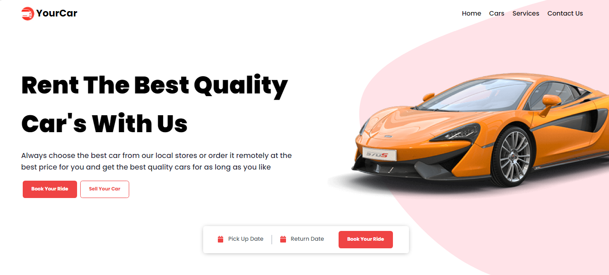

<div align="center">
  <p align="center">
    
  </p>
 <h1>Front-end React-Cars-App </h1>
 <h3>Projeto em Reactjs, Typescript, Tailwind, Styled Components <h3>
</div>

1. Instalação do Template disponível https://github.com/reduxjs/cra-template-redux-typescript

```bash
npx create-react-app react-cars-app --template redux-typescript
```

2. Instalação TailwindCSS - Instale a versão 2.2.19

```bash
https://v2.tailwindcss.com/docs/guides/create-react-app
```

3. No package.json mude a V5 para "react-scripts": "4.0.3". Em seguida execute:

```bash
yarn ou npm install
```

4. Instale

```bash
yarn add styled-components twin.macro

yarn add --dev @types/styled-components

yarn add react-burger-menu

yarn add react-responsive @types/react-responsive

```

5. Import no arquivo index.css a font Poppins

```bash
@import url("https://fonts.googleapis.com/css2?family=Poppins:wght@500;700;800;900&display=swap");
```

6. Instale os pacotes do fontawesome

```bash
yarn add @fortawesome/fontawesome-svg-core @fortawesome/free-solid-svg-icons @fortawesome/react-fontawesome

yarn add @fortawesome/free-brands-svg-icons @fortawesome/free-regular-svg-icons

yarn add
```

7. Instale o pacote Calendário do React

```bash
yarn add react-calendar

yarn add -D @types/react-calendar

```
